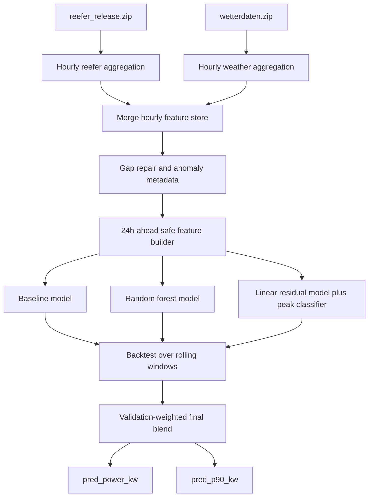

# Reefer Forecast Documentation

## 1. Purpose

This document describes the forecasting pipeline in `work/reefer_forecast.py`, including:

- the model architecture
- the model inputs and outputs
- the preprocessing workflow
- the model selection result
- the generated figures that can be used in a report or handoff

The task is to forecast hourly aggregate reefer terminal power 24 hours ahead while also producing an upper-risk estimate (`pred_p90_kw`).

## 2. Problem Setup

The challenge uses container-level reefer telemetry plus weather data to predict terminal-level hourly power demand.

The evaluation score is:

`0.5 * mae_all + 0.3 * mae_peak + 0.2 * pinball_p90`

Lower is better.

This means the final approach must balance:

- average accuracy across all hours
- stronger behavior during high-load hours
- a calibrated upper prediction bound

## 3. Model Architecture

The final pipeline is not a single model. It is a small model zoo plus a validation-selected ensemble.

### 3.1 High-level flow



### 3.2 Candidate models

The script evaluates three named candidates recorded in `work/output/model_registry.csv`:

- `baseline`
  - analytic blend of lagged load signals
  - formula: `0.55 * lag_power_24h + 0.30 * lag_power_168h + 0.15 * rolling_mean_24h`
- `random_forest`
  - tree-based regressor trained on the engineered forward-safe feature view
- `final_blend`
  - the final selected ensemble
  - combines the strongest backtest candidates using inverse-score weighting from validation

There is also a linear residual architecture inside the codebase:

- a state ridge model
- a composition ridge model
- a prior ridge model
- a logistic peak classifier

This linear stack is used for diagnostics and internal forecasting logic, but the selected public winner in the final registry is the validation-weighted blend of the best-performing candidates.

### 3.3 Why the architecture is layered

Each layer has a different role:

- the baseline stabilizes the forecast with yesterday/week-ago memory
- the random forest captures non-linear interactions in the engineered features
- the blend reduces single-model brittleness and improves the challenge score
- the `p90` calibration converts point forecasts into a useful upper-bound estimate

## 4. Inputs

The pipeline consumes the following participant-package files:

- `participant_package/reefer_release.zip`
- `participant_package/wetterdaten.zip`
- `participant_package/target_timestamps.csv`
- `participant_package/feature_importance.csv`

### 4.1 Raw reefer inputs

The reefer dataset is aggregated from container rows into one hourly terminal table. Important raw fields include:

- `EventTime`
- `AvPowerCons`
- `TemperatureSetPoint`
- `TemperatureAmbient`
- `TemperatureReturn`
- `RemperatureSupply`
- `ContainerSize`
- `HardwareType`
- `stack_tier`

### 4.2 Raw weather inputs

The weather files are resampled to hourly level and merged on UTC timestamp. The main derived weather fields include:

- Halle 3 temperature
- Zentralgate temperature
- mean temperature across available sensors
- sensor spread and availability indicators

## 5. Preprocessing

### 5.1 Hourly aggregation

The first preprocessing step collapses container-level reefer rows into one hourly terminal snapshot:

- `power_kw` is computed as summed reefer power divided by `1000`
- active container count is counted per hour
- mean reefer temperatures are averaged per hour
- hardware mix, size mix, and stack-tier shares are converted into hourly proportions

### 5.2 Weather alignment

Weather records are:

- parsed from `wetterdaten.zip`
- converted to hourly timestamps
- merged to the reefer hourly table
- summarized into hourly means and availability flags

### 5.3 Gap handling

The pipeline explicitly repairs a hard gap in the observed chronology:

- gap start: `2025-03-30 08:00:00 UTC`
- gap end: `2025-04-23 13:00:00 UTC`

For hours inside this missing interval, the script creates a bridged blend using matched historical group means from:

- the pre-gap block
- the post-gap block

The blend transitions smoothly across the missing period and records metadata such as:

- `is_imputed_gap_row`
- `imputation_progress_ratio`
- `imputation_source_pre_weight`
- `imputation_source_post_weight`
- `imputation_confidence`

The ablation table in `work/output/ablation_metrics.csv` shows that the bridged-gap strategies outperformed simpler alternatives such as midpoint imputation.

### 5.4 Anomaly metadata

The preprocessing layer also computes anomaly and continuity flags, including:

- jump-up and jump-down indicators
- low-load crash-hour flags
- continuity checks
- whether the recent history touches imputed rows
- whether recursive rollout history already contains predicted values

### 5.5 Forward-safe feature construction

Every feature row for target hour `t` is built from a cutoff at `t-24h`.

This is the main leakage guardrail of the pipeline.

The feature builder uses:

- lagged power at `t-24h`, `t-48h`, `t-72h`, `t-168h`
- rolling summaries over 24h, 72h, and 168h
- cutoff-hour reefer state
- cutoff-hour fleet composition
- target-time calendar features
- weather features available at the cutoff
- metadata about imputation and recursive history use

## 6. Feature Families

The main feature families are:

- operational state
  - active container count
  - power per active reefer
  - anomaly flags
- temperature state
  - setpoint, ambient, return, supply
  - ambient-minus-setpoint
  - return-minus-supply
- fleet composition
  - hardware-family shares
  - container-size shares
  - stack-tier shares
- temporal structure
  - hour of day
  - day of week
  - month
  - day-of-year sin/cos
- historical load memory
  - lags
  - rolling mean, median, min, max
  - recent slope and acceleration
- data quality context
  - imputed-history share
  - predicted-history share

The feature-priority export in `work/output/feature_priority.csv` suggests the strongest signals were:

- `active_container_count`
- `day_of_year`
- `mean_temperature_setpoint_c`
- `month`
- `mean_temperature_return_c`
- `mean_temperature_supply_c`
- `mean_stack_tier`

## 7. Outputs

### 7.1 Main prediction file

The required public prediction output is `work/output/predictions.csv`.

It contains exactly three columns:

- `timestamp_utc`
- `pred_power_kw`
- `pred_p90_kw`

Meaning:

- `pred_power_kw`: point forecast for terminal load in kW
- `pred_p90_kw`: upper-risk forecast, constrained to be at least as large as `pred_power_kw`

### 7.2 Additional run artifacts

The script also writes:

- `work/output/backtest_metrics.json`
- `work/output/model_registry.csv`
- `work/output/model_window_metrics.csv`
- `work/output/model_predictions_backtest.csv`
- `work/output/january_rollout_details.csv`
- `work/output/predictions_january_full.csv`
- `work/output/audit_table.csv`

These files document:

- which model won
- how each model behaved per validation window
- the recursive January rollout forecast
- the audit trail of preprocessing and imputation

## 8. Who Won

The official winner from the backtest selection was:

- `final_blend`

From `work/output/model_registry.csv`, the aggregate scores were:

- `final_blend`: `52.815`
- `baseline`: `59.866`
- `random_forest`: `60.848`

The winning model therefore achieved the best combined score under the challenge metric.

Its aggregate component metrics from `work/output/backtest_metrics.json` were:

- `mae_all = 64.521`
- `mae_peak = 58.426`
- `pinball_p90 = 15.135`

Important nuance:

- on the recursive January rollout overlap, `baseline` had the best overlap-only score (`88.459`) versus `final_blend` (`92.652`)
- however, the official model-selection backtest across the four rolling windows selected `final_blend`

So the final documented answer to "who won?" is:

- `final_blend` won the official model selection used for the submission pipeline

## 9. Figures For The Report

The following generated figures are good candidates to include in a report.

### Figure 1. Gap repair overview


Caption: Original hourly reefer load around the March-April 2025 hard gap compared with the repaired bridged series used for model training.

### Figure 2. Feature importance summary


Caption: Ranked feature-priority summary showing that operational load context, calendar position, and reefer temperature variables were the strongest forward-safe predictors.

### Figure 3. Model comparison on observed overlap


Caption: Comparison of baseline, random-forest, and final-blend forecasts against the observed January overlap period used for offline validation.

### Figure 4. Full January rollout forecast


Caption: Full recursive January 2026 forecast generated by the selected pipeline, including the period after observed labels are no longer available.

### Figure 5. Backtest score comparison


Caption: Aggregate comparison of the candidate models under the challenge scoring components, showing the final blend as the strongest overall choice.

## 10. Reproducibility

To regenerate the artifacts:

```bash
python3 work/reefer_forecast.py --data-dir participant_package --output-dir work/output
```

Main implementation:

- `work/reefer_forecast.py`

Supporting references:

- `work/architecture.md`
- `work/approach.md`
- `participant_package/EVALUATION_AND_WINNER_SELECTION.md`

## 11. Short Summary

This forecasting solution aggregates raw reefer and weather data to hourly level, repairs a known gap in the historical record, builds strictly 24-hour-ahead-safe features, evaluates several candidate models, and selects a validation-weighted final blend for submission. The final winner was `final_blend`, which achieved the best combined score across the rolling backtest windows while preserving a calibrated `p90` risk estimate.
